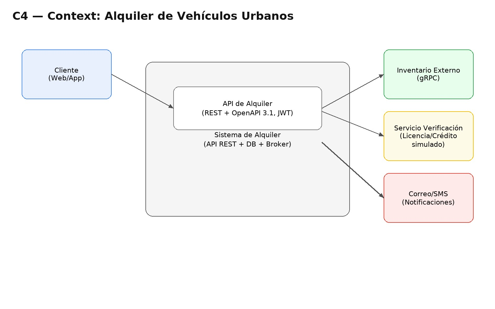

# C4 - Nivel 1: Contexto del Sistema

El sistema de **Alquiler de Vehículos Urbanos** permite a los usuarios alquilar autos, bicicletas y scooters de manera ágil desde una app web o móvil.

**Actores principales:**
- **Usuario:** utiliza la aplicación para crear y confirmar reservas.
- **API REST:** núcleo del sistema, gestiona vehículos y reservas.
- **Base de Datos (PostgreSQL):** almacena el estado de las reservas y los vehículos.
- **Broker (RabbitMQ):** maneja las tareas asincrónicas como verificaciones o notificaciones.
- **Keycloak (futuro):** proveerá autenticación y emisión de JWT.
- **Sistema Externo (Inventario):** stub gRPC que simula la consulta de disponibilidad de vehículos.