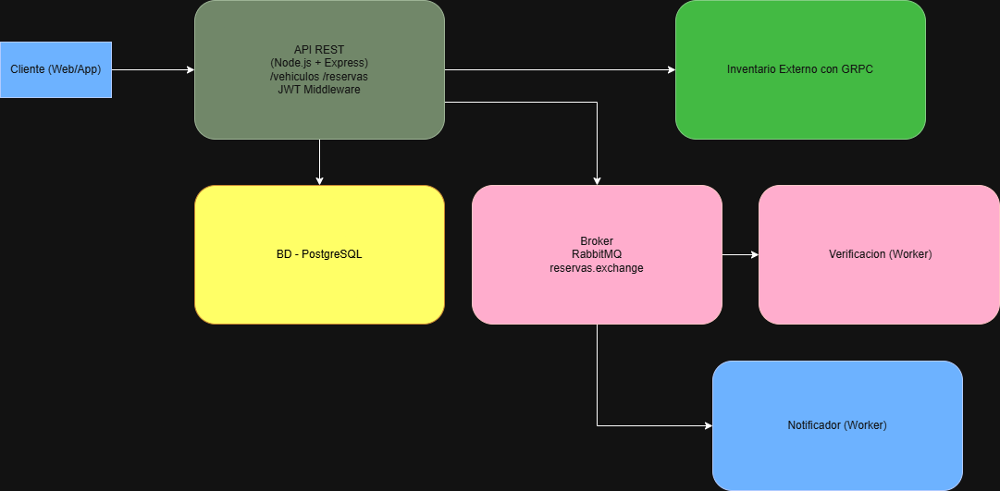

# C4 - Nivel 2: Contenedores

**Contenedores del sistema:**

- **API (Node.js + Express):** punto de entrada, expone endpoints `/vehicles`, `/reservations` y `/reservations/{id}/confirm`.
- **Worker (placeholder):** simula consumo de mensajes desde RabbitMQ.
- **DB (PostgreSQL):** persistencia de datos de vehículos y reservas.
- **Broker (RabbitMQ):** middleware para comunicación asincrónica.
- **Keycloak (futuro):** gestión de autenticación.

**Flujo general:**
1. El usuario envía una solicitud a la API.
2. La API valida y persiste la reserva en la DB.
3. Se encola un mensaje en RabbitMQ para procesar la verificación.
4. El Worker (placeholder) consume el mensaje y simula la notificación.