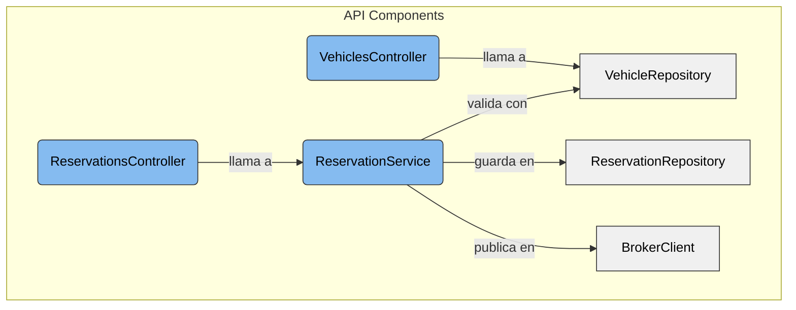

# C4 - Nivel 3: Componentes de la API

Componentes internos principales de la API:

- **VehiclesController:** expone endpoints relacionados con vehículos (`GET /vehicles`).
- **ReservationsController:** permite crear y confirmar reservas (`POST /reservations`, `POST /reservations/{id}/confirm`).
- **ReservationService:** implementa las reglas de negocio y valida solapamientos.
- **Repositories:** gestionan acceso a datos (`VehicleRepository`, `ReservationRepository`).
- **BrokerClient:** conexión y publicación de mensajes a RabbitMQ.
- **AuthMiddleware (placeholder):** simula la validación de JWT.
